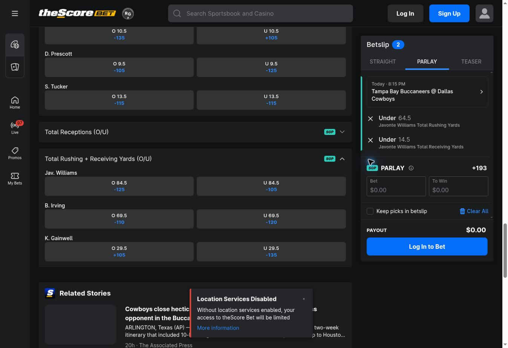
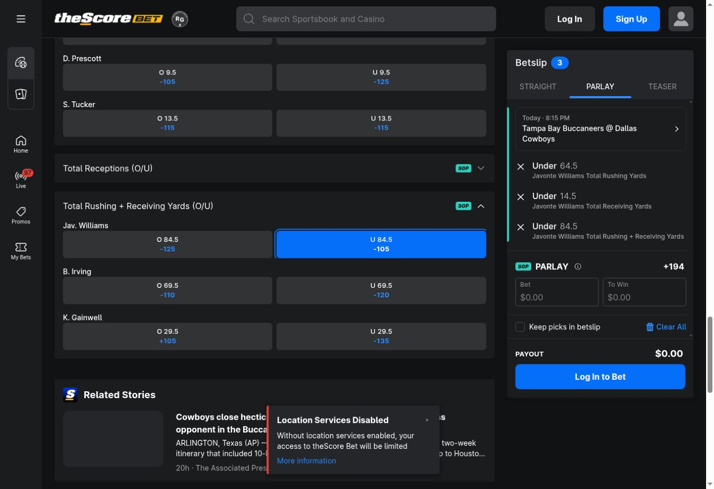

# theScore Bet redundant-leg SGP study — October 8, 2026

**One of eight tested constructions produced a repeatable displayed-price improvement. It failed the FanDuel-based positive-EV screen.** This is a small exploratory sample, not an estimate of how often pricing anomalies occur.

All observations were made on the Ontario-branded public quote builders, logged out, from 16:59 to 17:20 UTC (12:59–13:20 EDT). No stake was entered and no wager was submitted. The site displayed location limitations; these are displayed quotes, not accepted or executable offers.

## Finding: Javonte Williams unders

Tampa Bay Buccaneers at Dallas Cowboys, October 8. theScore displayed 8:15 PM ET; FanDuel displayed 8:16 PM ET for the corresponding matchup.

| Variant | Legs | theScore American | Decimal |
| --- | --- | ---: | ---: |
| A | Javonte Williams under 64.5 rushing yards AND under 14.5 receiving yards | +193 | 2.93 |
| B | A AND under 84.5 rushing + receiving yards | +194 | 2.94 |

For integer final yard totals, A implies rushing ≤64 and receiving ≤14, hence the sum ≤78. The third leg therefore imposes no additional constraint on the completed-game winning outcome. This is logical redundancy, not merely positive correlation. Unusual void/abandonment/participation settlements still require separate contract review.

The gross payout improvement is `2.94 / 2.93 - 1 = 0.3413%`, equivalent to $0.01 more gross return per hypothetical $1 at the displayed prices. Whole-American-odds rounding could explain this small difference; the study does not establish the pricing mechanism or the accepted payout.

| Capture UTC | Variant | Odds | Raw theScore index |
| --- | --- | ---: | ---: |
| 17:07:52.732 | A | +193 | 15 |
| 17:08:03.797 | B | +194 | 16 |
| 17:08:43.704 | A | +193 | 18 |
| 17:08:58.233 | B | +194 | 19 |
| 17:18:31.636 | A | +193 | 24 |
| 17:19:36.090 | B | +194 | 25 |

## FanDuel joint-market devig and EV screen

The inspected FanDuel rushing board offered **68.5**, not theScore's 64.5. Its receiving line was 14.5. The visible alternative rushing ladder offered 60+ and 70+, which do not reproduce 64.5. Consequently this study does **not** report an exact fair probability for the target.

For completed games under common settlement assumptions, the target event `{rush <64.5, receive <14.5}` is a subset of FanDuel's `{rush <68.5, receive <14.5}`. The latter gives a model-dependent upper bound on the target probability. This direction matters: a looser under line must not be presented as an exact match.

All four joint SGP outcomes were captured, preserving the dependence already reflected in the book's quotes. Individual-leg probabilities were not multiplied.

| Rushing 68.5 | Receiving 14.5 | FanDuel odds | Decimal | Capture UTC | Raw FD index |
| --- | --- | ---: | ---: | --- | ---: |
| Under | Under | +234 | 3.34 | 17:11:40.614 | 4 |
| Over | Under | +221 | 3.21 | 17:12:30.496 | 5 |
| Over | Over | +232 | 3.32 | 17:13:06.345 | 6 |
| Under | Over | +219 | 3.19 | 17:14:00.988 | 7 |

Under/over at half-yard lines forms four disjoint, exhaustive cells for final numeric yard totals. A final under/under recapture at 17:18:53.455 UTC remained +234 (FD index 8). The four cells were collected sequentially over about 140 seconds, not atomically; unobserved movement remains possible.

For cell decimal odds `d_i`, set `q_i = 1/d_i`. Proportional devig uses `p_i = q_i / sum(q)`. Here `sum(q) = 1.2256121205`, an overround of **22.56%**. The under/under probability is **24.4287%**, versus **34.0136%** needed to break even at +194.

Using decimal gross return `D = 2.94`, the standard binary-outcome net EV per unit is `pD - 1`. Substituting the reference superset probability gives:

`EV_target ≤ 2.94 × 0.2442870731 - 1 = -28.1796%`.

A power devig sensitivity check solves `sum(q_i^k) = 1`, yielding `k = 1.1720257294`, under/under probability **24.3308%**, and an EV upper bound of **−28.4676%**. Both models reject this candidate. These are conditional, reference-model bounds, not proven true EV or a confidence interval. FanDuel can misprice the joint distribution, and devigging does not remove that uncertainty.

## Full exploration log

| Case | Base | Added leg | Base odds | With leg | Outcome | Raw theScore indices |
| --- | --- | --- | ---: | --- | --- | --- |
| DAL spread | Dallas −9.5 | Dallas moneyline | −105 | −105 | No improvement | 9–10; earlier 0 |
| Suzuki goal | Nick Suzuki over 0.5 goals | Over 0.5 points | +160 | Rejected | Related-market restriction | 2–3 |
| MTL spread/total | Montreal −1.5 AND game under 6.5 | Nashville under 2.5 regulation goals | +277 | Rejected | Added market ineligible for SGP | 4–6 |
| MTL spread/total | Montreal −1.5 AND game under 6.5 | Montreal moneyline | +277 | Rejected | Related-market restriction | 7–8 |
| DAL spread/total | Dallas −9.5 AND game under 48.5 | Tampa Bay under 19.5 | +217 | +217 | No improvement, A/B/A checked | 11–14 |
| Javonte unders | Rush under 64.5 AND receive under 14.5 | Combined under 84.5 | +193 | +194 | Repeatable improvement | 15–19, 24–25 |
| Bucky unders | Bucky Irving rush under 49.5 AND receive under 13.5 | Combined under 69.5 | +204 | +204 | No improvement | 20–21 |
| Javonte milestones | Rush 70+ AND receive 20+ | Combined 90+ | +360 | +360 | No improvement | 22–23 |

These comprise one improvement, four unchanged quotes, and three rejected constructions. They are eight constructions across two events, not eight independent samples. Single-leg bases test whether the quote builder recognizes a trivial redundant pair; they are retained as controls alongside additions to existing SGPs.

For the spread/total implications: Dallas winning by at least 10 with total ≤48 implies Tampa Bay ≤19. Montreal winning by at least 2 with total ≤6 implies Nashville ≤2 final goals, hence ≤2 regulation goals; the latter was rejected because the added regulation market was ineligible. Bucky's two unders imply combined yards ≤62; Javonte's two milestones imply combined yards ≥90.

The raw log also preserves one accidental Zack Bolduc single-goal selection (index 1), excluded because no corresponding redundant-leg test was performed. FanDuel indices 0–3 retain a preliminary four-cell NHL partition (+311, +336, +212, +163). They do not support a redundant-leg finding because the added theScore NHL legs were rejected.

## Evidence and limitations

- [Raw timestamped quote-builder text](raw-observations.json) contains 26 theScore observations and 9 FanDuel observations. IDs above are zero-based array indices. Observations are primary browser captures, not a historical odds feed.
- [Derived calculations](analysis.json) and [reproduction script](analyze.py) retain exact numeric inputs and explicitly leave exact target EV unset. Run `python3 reports/thescore-sgp-redundancy-2026-10-08/analyze.py` from the repository root. The script validates the selected players, lines, four reference cells, and repeated A/B price sequence before calculating.
- Quotes updated asynchronously after UI selection changes. Immediate intermediate prices were disregarded; settled snapshots and later repeats were used. No claim rests on an immediately retained stale price.
- [theScore Ontario rules](https://thescorebethelp.zendesk.com/hc/en-us/articles/13873610640013-House-Rules-Ontario), reviewed October 8, include overtime in football markets unless stated otherwise and provide separate rules for voided/pushed SGP legs. Full cross-book equivalence for injury, participation, abandonment, stat corrections, and voided selections was not established. The probability partition and redundancy claim here concern completed-game numeric outcomes.
- FanDuel's [Ontario terms endpoint](https://account.on.sportsbook.fanduel.ca/terms) did not yield readable rule text through the research reader. No unsupported assertion of identical cross-book settlement is made.
- No boosts were applied. Account eligibility, maximum stake, accepted price, and subsequent outcomes were not tested. Pinnacle SGP availability was not established in this pass; FanDuel supplied the reference.

## Continuing the study

Use the same A/B/A quote sequence for each candidate, recording exact event, player, thresholds, scope, timestamps, eligibility errors, and screenshots. Record unchanged and rejected candidates as well as improvements. Establish logical implication before calling a leg redundant. Prefer an exact matching four-cell reference partition; where only a superset is available, preserve the bound direction. A positive upper bound alone cannot establish positive target EV. Strong candidates additionally need matched settlement rules and a fresh executable quote before any profitability conclusion.
